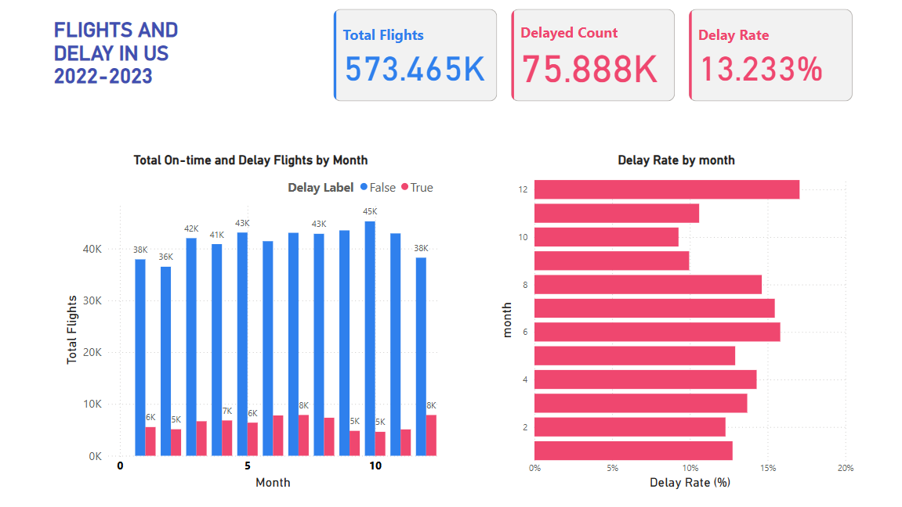
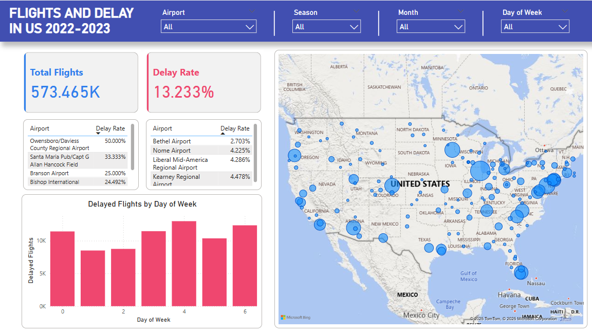

### Overview
This project analyzes and visualizes U.S. flight delay patterns from 2022 to 2023 using the Flight Delay & Cancellation Dataset. It includes:
- Delay trends by airline, origin/destination airports
- Weather impact on delays
- Top airports with high/low delay rates
- Summary metrics and visual dashboard

### Key Visualizations
### Total Flights and Delay Rate, Delay Distribution by Months

### Top 5 Airports with Highest/ Lowest Delay Rates and Delay Distribution by Day of Week

